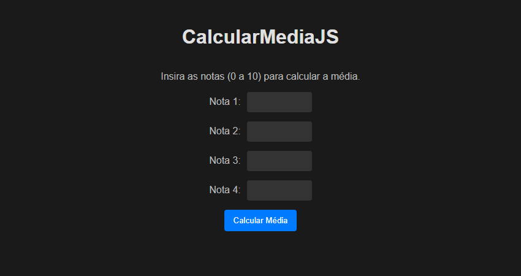

# CalcularMediaJS

## Descrição

CalcularMediaJS é uma aplicação web simples e direta para calcular a média aritmética de quatro notas. Desenvolvido com HTML, CSS e JavaScript, este projeto oferece uma interface intuitiva para inserir notas e obter o resultado da média de forma rápida.

## Funcionalidades

* Cálculo automático da média aritmética de quatro notas.
* Interface minimalista e fácil de usar.
* Validação de entrada para garantir que apenas números sejam inseridos.
* Feedback visual claro com o resultado da média.

## Como usar

1.  Clone o repositório:

    ```bash
    git clone https://github.com/roycyeduardo/CalcularMediaJS.git
    ```

2.  Abra o arquivo `index.html` em seu navegador.

3.  Insira as quatro notas nos campos correspondentes.

4.  Clique no botão "Calcular Média" para obter o resultado.

## Tecnologias utilizadas

* HTML5
* CSS3
* JavaScript

## Melhorias futuras

* Permitir a inserção de um número variável de notas.
* Melhorar a estilização e responsividade da interface.
* Implementar persistência de dados (armazenamento das notas e resultados).

## Visualizar Website

[Clique aqui](https://roycyeduardo.github.io/CalcularMediaJS) para visualizar o website.

## Imagem do projeto


